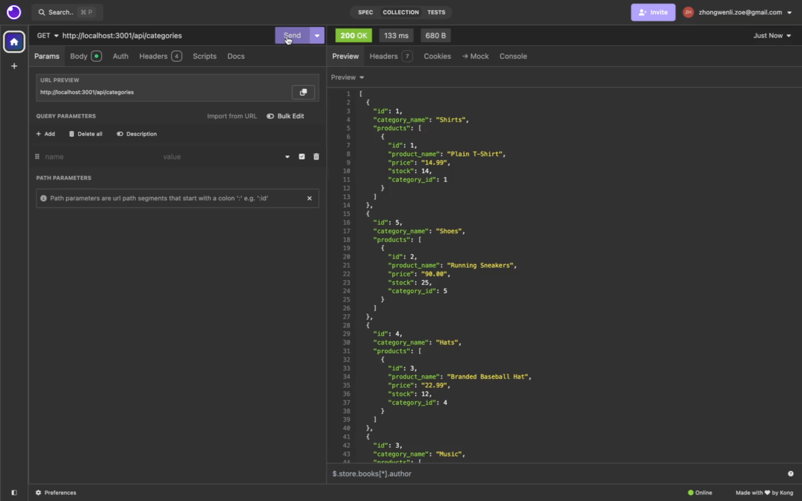
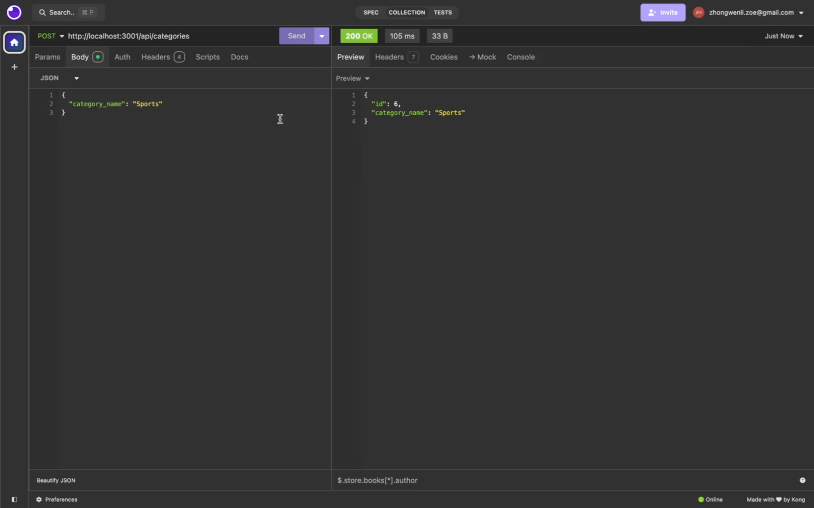

# E-Commerce Back End (Module 13 Challenge)

## Description
The back end for an e-commerce site.

## Walkthrough Video Link
https://drive.google.com/file/d/1iLhJCn-CGpmCKxoNb5l9mUIvwc6vnWVu/view?t=11

## Credits
Stater code: 

https://github.com/coding-boot-camp/bookish-sniffle